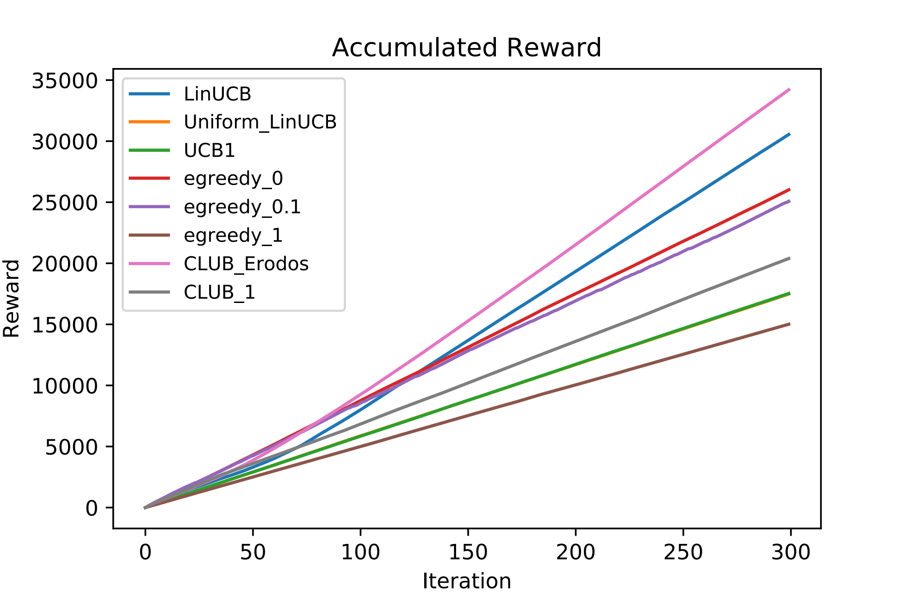

# IMBandits

IMBandit.py -- Simulator.

egreedy.py -- epsilon-greedy and UCB1 exploration strategy.

degreeDiscount.py, generalGreedy.py -- Two different oracles (IM algorithm).

IC/IC.py -- Independent cascade model, runIC() returns influence result given seed nodes.

### Result

**Attention: The oracle for general greedy and the Bandit algorithm for cab consume so so so so so much time and they are not recommended for experiment.**

#### Parameter

```python
graph_address = './datasets/Flickr-Topic/Small_Final_SubG.G'
topic_address = './datasets/Flickr-Topic/TopicTheta.list'
feature_address = './datasets/Flickr-Topic/Small_Final_Normalized_edgeFeatures_uniform_dim4.dic'

dataset = 'Flickr' #Choose from 'default', 'NetHEPT', 'Flickr'
FeatureScaling = 1.0
batchSize = 1
alpha = 0.1
alpha_2 = 0.1 
lambda_ = 0.3
gamma = 0.1
dimension = 4
seed_size = 40
iterations = 300

oracle = degreeDiscountIAC2
```

#### Experiment

```
Iteration 299  Elapsed time 23:49:48.691486
average reward for oracle: 181.47666666666666
LinUCB: 156.75
Uniform_LinUCB: 83.90
UCB1: 83.96
egreedy_0.1: 133.28
CLUB_Erodos: 127.71
CLUB_1: 114.36
```

<p float="left">


</p>

