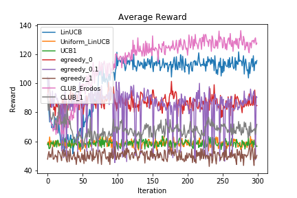
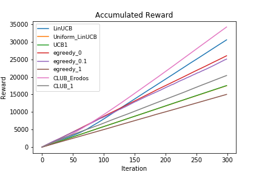

# IMBandits

IMBandit.py -- Simulator.

egreedy.py -- epsilon-greedy and UCB1 exploration strategy.

degreeDiscount.py, generalGreedy.py -- Two different oracles (IM algorithm).

IC/IC.py -- Independent cascade model, runIC() returns influence result given seed nodes.

### Result

**Attention: The oracle for general greedy and the Bandit algorithm for cab consume so so so so so much time and they are not recommended for experiment.**

#### Parameter

```python
graph_address = './datasets/Flickr3/Small_Final_SubG.G'
prob_address = './datasets/Flickr3/Small_Final_Edge_P_Uniform_dim4'
feature_address = './datasets/Flickr3/Small_Final_Normalized_edgeFeatures_uniform_dim4.dic'

dataset = 'Flickr' #Choose from 'default', 'NetHEPT', 'Flickr'
FeatureScaling = 1.0
batchSize = 1
alpha = 0.1
alpha_2 = 0.1 
lambda_ = 0.3
gamma = 0.1
dimension = 4
seed_size = 40
iterations = 300

oracle = degreeDiscountIAC2
```

#### Experiment

```
average reward for oracle: 132.9988888888889
LinUCB: 102.22
Uniform_LinUCB: 58.46
UCB1: 58.61
egreedy_0: 87.01
egreedy_0.1: 83.88
egreedy_1: 50.20
CLUB_Erodos: 114.45
CLUB_1: 68.21
```

<p float="left">


</p>

The above two figures are the result that work. The difference between the this and other results showed in README is that, the dataset is sampled from the nodes that have a the degree smaller than 20. While the others use the dataset sampled nodes which have degree larger than 40, so that almost every algorithm achieves a good result compared to the oracle.
