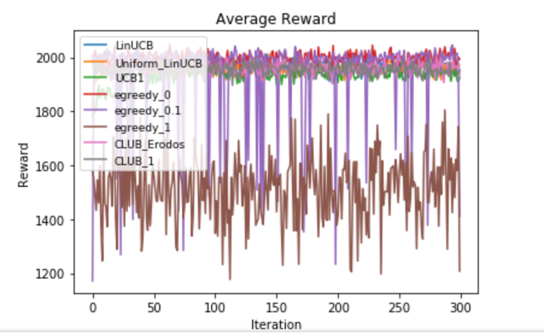
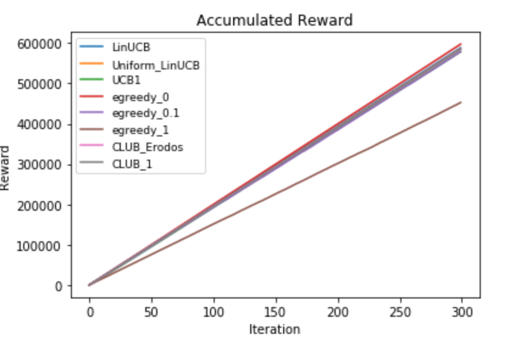
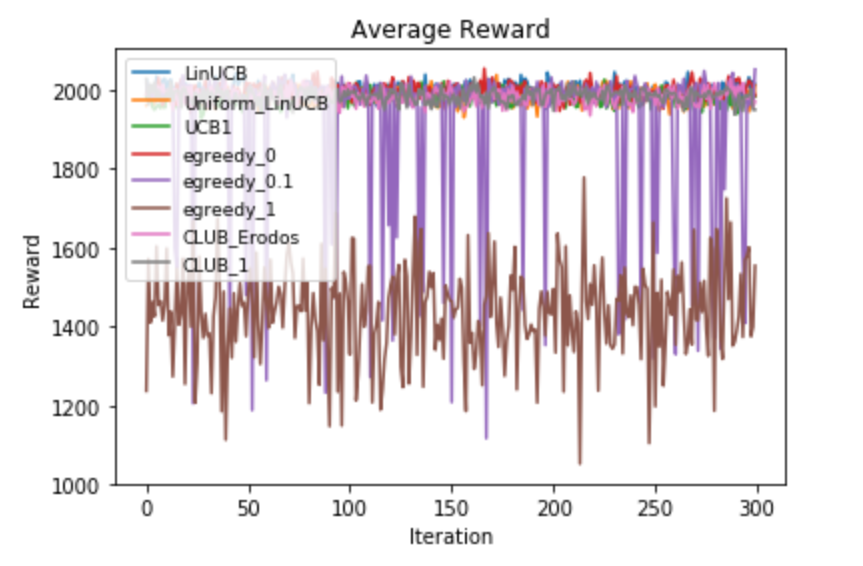
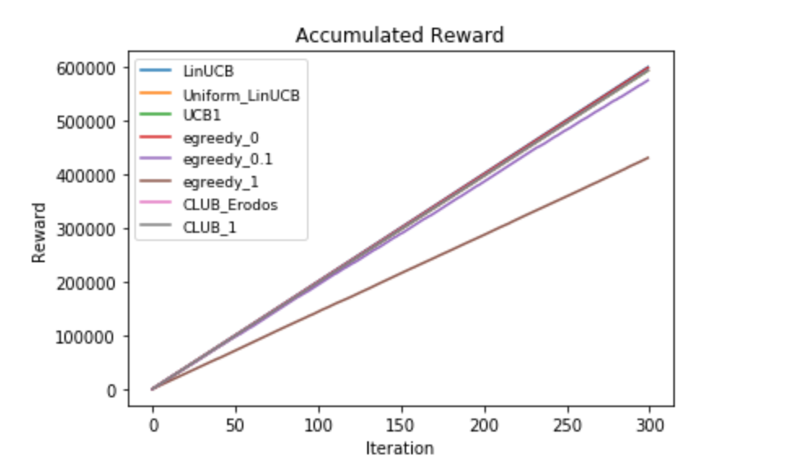
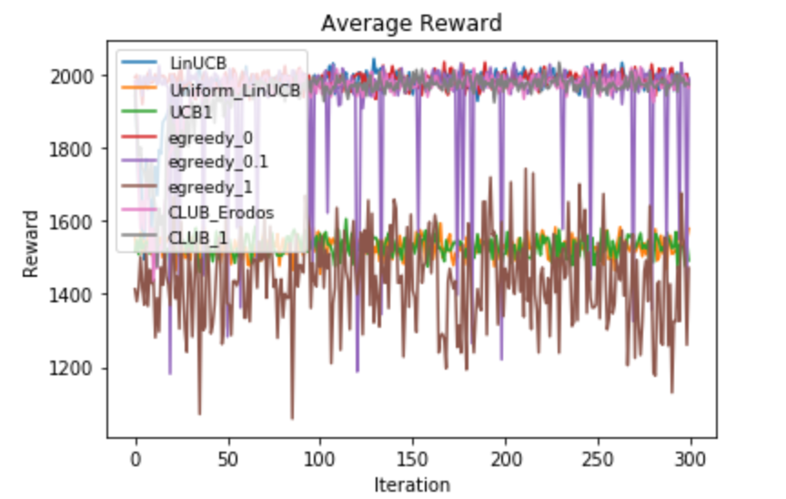
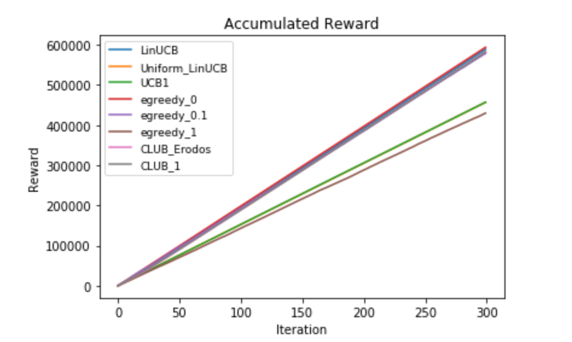

# IMBandits

IMBandit.py -- Simulator.

egreedy.py -- epsilon-greedy and UCB1 exploration strategy.

degreeDiscount.py, generalGreedy.py -- Two different oracles (IM algorithm).

IC/IC.py -- Independent cascade model, runIC() returns influence result given seed nodes.

### Result

**Attention: The oracle for general greedy and the Bandit algorithm for cab consume so so so so so much time and they are not recommended for experiment.**

#### Parameter

```python

graph_address = './datasets/Flickr/Small_Final_SubG.G'
prob_address = './datasets/Flickr/Small_Final_Edge_P_Uniform_dim4'
feature_address = './datasets/Flickr/Small_Final_Normalized_edgeFeatures_uniform_dim4.dic'

dataset = 'Flickr' #Choose from 'default', 'NetHEPT', 'Flickr'
FeatureScaling = 1.0
batchSize = 1
alpha = 0.1
alpha_2 = 0.1 
lambda_ = 0.3
gamma = 0.1
dimension = 4
seed_size = 40
iterations = 300

oracle = degreeDiscountIAC
```

#### Experiment

```
average reward for oracle: 2013.1888888888889
LinUCB: 1967.69
Uniform_LinUCB: 1958.30
UCB1: 1934.53
egreedy_0: 1997.54
egreedy_0.1: 1934.25
egreedy_1: 1512.52
CLUB_Erodos: 1957.71
CLUB_1: 1956.60
```
<p float="left">


</p>

For another dataset sampled in the same way by Flickr:
```
average reward for oracle: 2001.77
LinUCB: 2002.15
Uniform_LinUCB: 1983.17
UCB1: 1980.37
egreedy_0: 1998.01
egreedy_0.1: 1921.00
egreedy_1: 1438.44
CLUB_Erodos: 1984.28
CLUB_1: 1984.9
```
<p float="left">


</p>

#### Parameter

```python
graph_address = './datasets/Flickr/Small_Final_SubG.G'
prob_address = './datasets/Flickr/Small_Final_Edge_P_Uniform_dim4'
feature_address = './datasets/Flickr/Small_Final_Normalized_edgeFeatures_uniform_dim4.dic'

dataset = 'Flickr' #Choose from 'default', 'NetHEPT', 'Flickr'
FeatureScaling = 1.0
batchSize = 1
alpha = 0.1
alpha_2 = 0.1 
lambda_ = 0.3
gamma = 0.1
dimension = 4
seed_size = 40
iterations = 300

oracle = degreeDiscountIAC2
```

#### Experiment

```
average reward for oracle: 1954.6811111111112
LinUCB: 1907.56
Uniform_LinUCB: 1733.87
UCB1: 1729.36
egreedy_0: 1952.58
egreedy_0.1: 1924.06
egreedy_1: 1510.79
CLUB_Erodos: 1881.93
CLUB_1: 1874.47
```

<p float="left">


</p>

For another dataset sampled in the same way by Flickr:
```
average reward for oracle: 1987.7866666666666
LinUCB: 1967.71
Uniform_LinUCB: 1527.14
UCB1: 1528.11
egreedy_0: 1984.75
egreedy_0.1: 1933.33
egreedy_1: 1436.94
CLUB_Erodos: 1946.78
CLUB_1: 1945.93

```
<p float="left">


</p>

